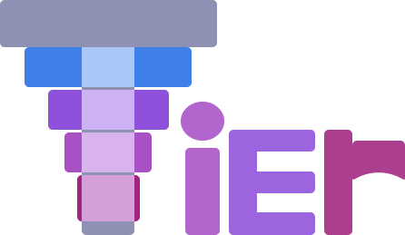

# Tier
\
Tier is a statically typed language inspired by C++ and Rust,
built around a **Tier**ed type system and a unique configuration
system using `#set` and `#enforce` directives.

## What does Tier aim to do?
- Focused on providing clarity and ease in flexibility.
- Tiered approach allows gradual learning, and flexibility.
- Enforce different coding standards for *all* code-bases.

## Tier is in it's early stages - WIP
