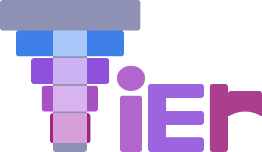

# Tier
# Tier (both the compiler and the language) is in it's early stages - WIP

\
Code in *Unity*.

Tier is a statically-typed systems-language inspired by C++ and Rust,
built around a **Tier**ed type system and a unique configuration
system using `#set` and `@enforce` directives.

## What does Tier aim to do?
- Clear and accurate diagnostics
- Focused on providing clarity and ease in flexibility.
- Tiered approach allows gradual learning, and flexibility.
- Enforce different coding standards for *all* code-bases.

## How to build:
- Go to the root.
- Make a `build` folder.
- Write the command `cmake -S . build`
- Then write the command `cmake --build build`.
- You will have a `build/tier` executable!
- You can run it by doing `./build/tier` or by entering the build folder then doing `./tier`.

## How to test:
- Go to `tests` folder
- Write in terminal: `(python interpreter, ex: python3) load_tests.py (compiler path, ex: ../build/tier)`
